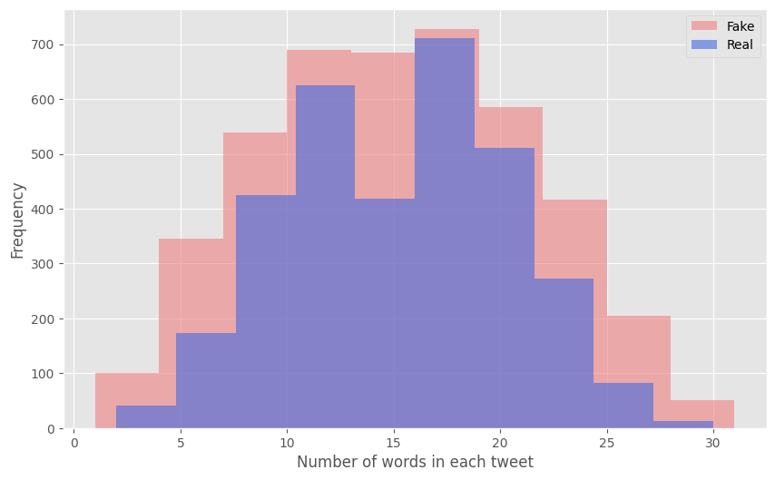
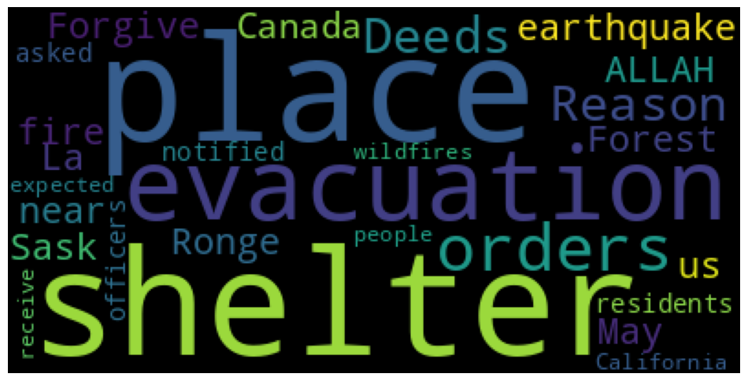
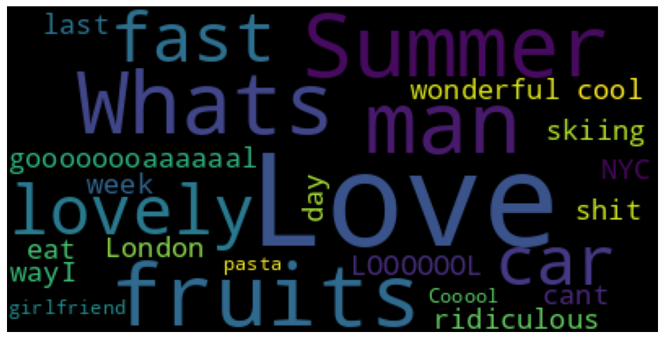
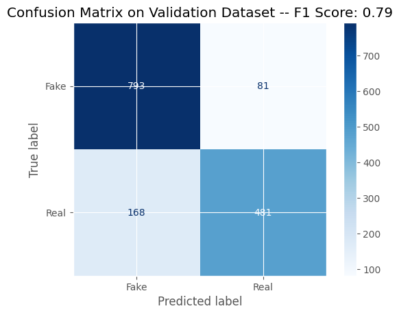

## Natural Language Processing: Identifying Disasters in Tweets
* Goal: Determine if a tweet is discussing a real disaster
* Results: The DistilBERT model from KerasNLP produced an F1 score of 0.79 on the validation data set.

### Summary :speaker:
* Background
* Exploratory Data Analysis
* Models
* Results
* Next Steps

### Background 
* X (previously Twitter) can be utilized as a useful communication method for emergencies.
* However, it may be difficult for a machine to determine if a tweet is describing a real emergency.
* For example, a tweet may say “This beach party is on FIRE”. A machine may think there is a fire from the word “FIRE” in the tweet instead of a metaphor.

  

### The Data :bar_chart:
* The dataset is from the Kaggle competition Natural Language Processing with Disaster Tweets. https://www.kaggle.com/competitions/nlp-getting-started

### Exploratory Data Analysis :paperclip: 
- [x] Features include tweet text and target (whether the tweet is discussing a real disaster or fake disaster)
- [x] Reviewed class balance, tweet length, number of words in each tweet 
- [x] Data cleaning: Stop words, HTML tags, emojis, and punctuation marks were removed
- [x] Word clouds were created after data cleaning

* Histogram of number of words in each tweet

  

* Word cloud for real disasters

  

* Word cloud for fake disasters

  

### Data Modeling :bar_chart:
* Used KerasNLP DistilBERT model with recommended parameters from Keras
* Used F1 score as main metric
* The model gave an F1 score of 0.79 on the validation data set

  

### Applications:
This model can be utilized by organizations that monitor disasters such as news agencies or disaster relief.

### Next steps:
* Optimize model parameters because the F1 score is lower than desired.
* Review data cleaning and see if additional cleaning is required.

 

